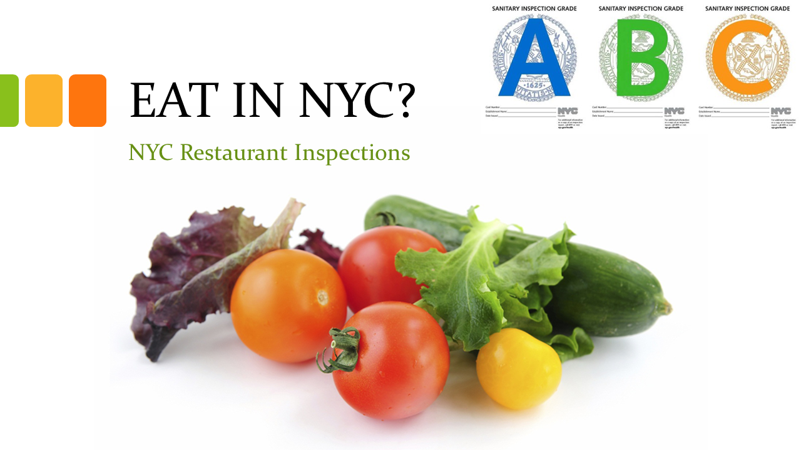

# nyc-restaurant-inspections

#### Project Team:

- Jordan Gilmartin
- Lynell Robinson
- Min Xie
- Nick Mangarella
- Christina Hawkins

#### 

#### Project Introduction:

In this project we explored restaurant inspection data that was from a dataset we found on Kaggle and created various visualizations of the data.  The original source of the data is the NYC Department of Health and Mental Hygiene (DOHMH).

#### 

#### Some questions we developed at the outset:

- What restaurants had no violations in their initial inspection?
- What restaurants had to go for re-inspection?
- Were restaurants able to improve their scores on the re-inspection?
- What restaurants had to close?
- What restaurants were able to reopen?

#### 

#### Summary of the Tools that we used for this project:

- Kaggle
- SQLite / SQLAlchemy
- Jupyter Notebook
- Flask
- JavaScript
- HTML
- Leaflet / Mapbox

#### 

#### Some of the highlights of our visualizations:

- Restaurant Infobox for Displaying and Sorting by Name, Address, etc.
- Map with Marker Showing Nature of Violation / Critical Flag
- Gauge of Restaurant by Grade
- Bar Chart Showing Critical Flag by Neighborhood
- Map Showing Flags for Rats and Roaches

#### 

#### References:

Kaggle Dataset: https://www.kaggle.com/sdawar/dohmh-newyork-city-restaurant-inspection-results

